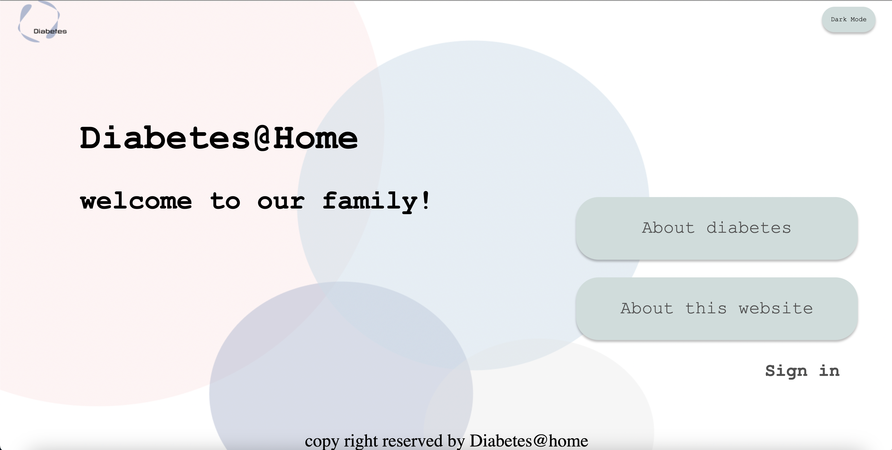
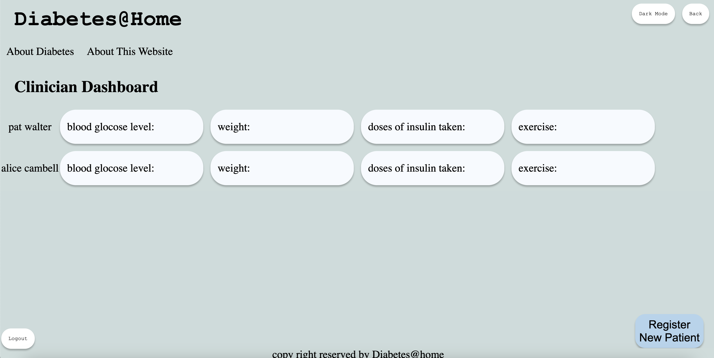
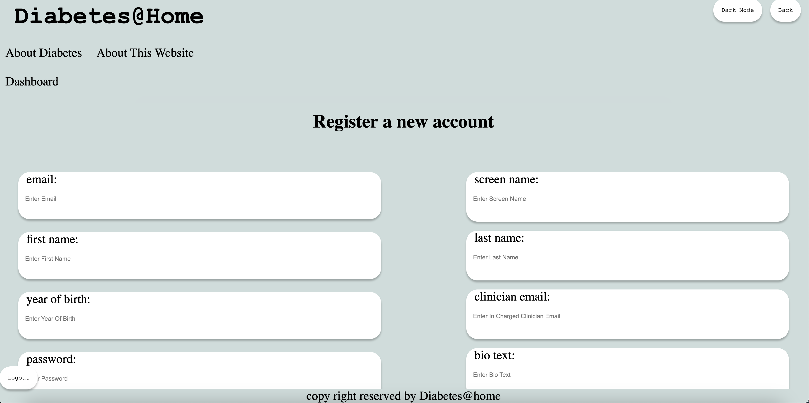
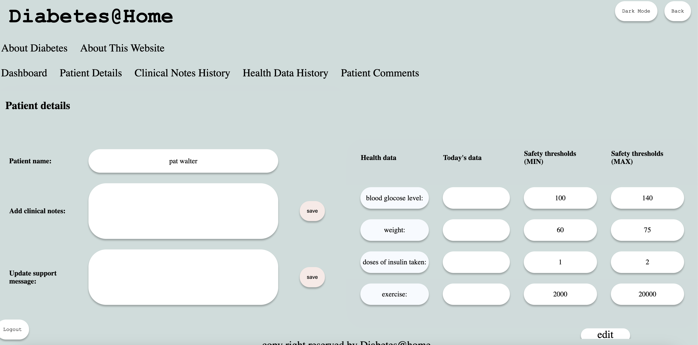
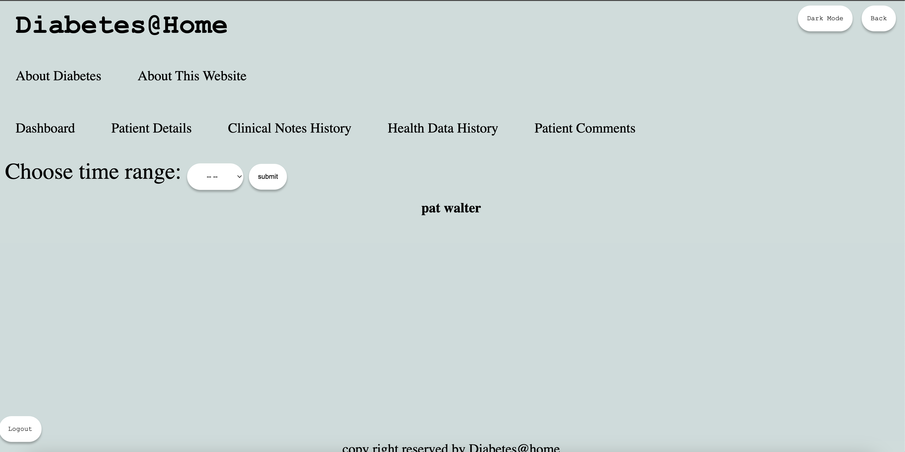
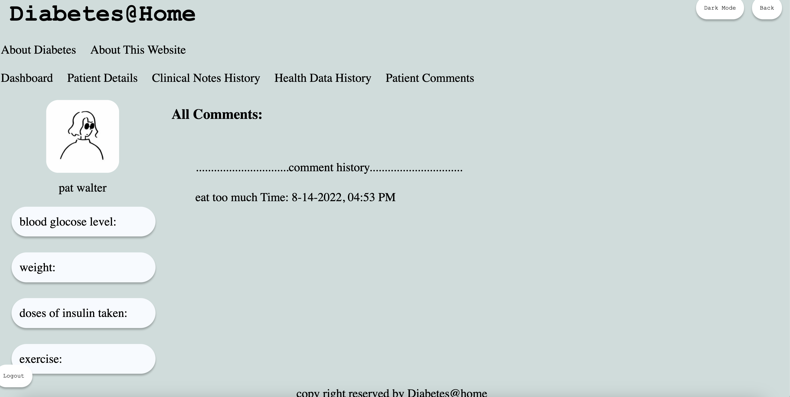
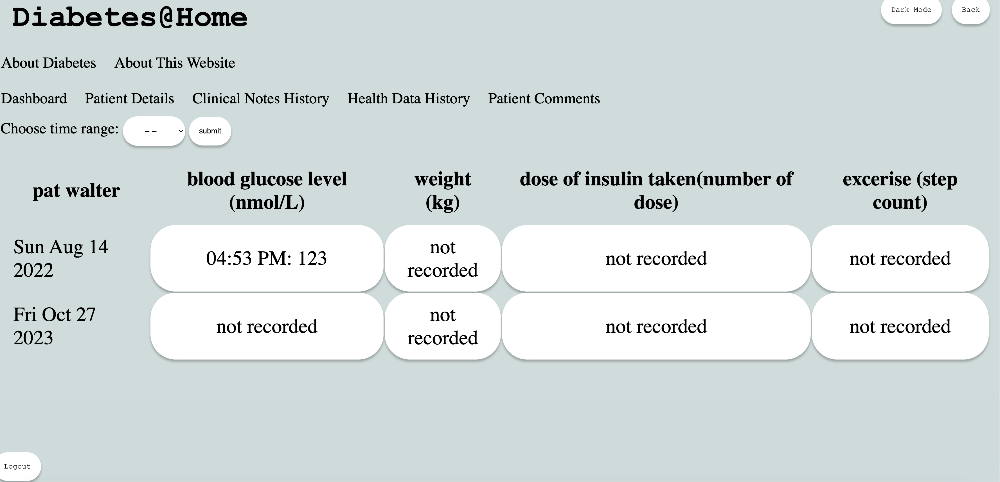
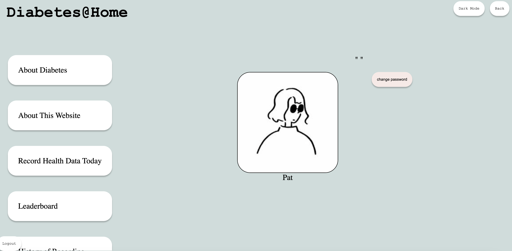
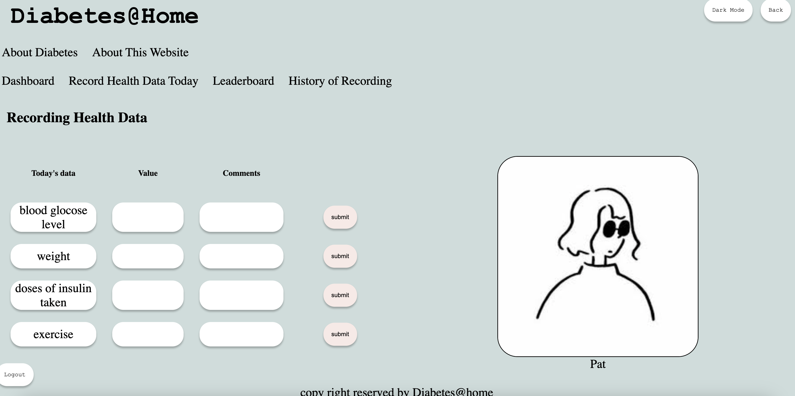
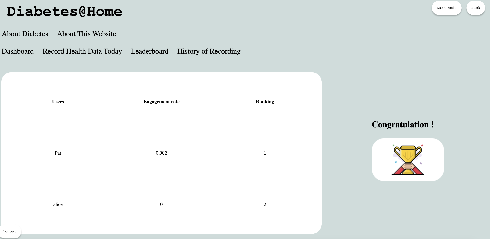

# Daibetes-tracker

# Getting started
- Install node_modules via package.json
> Type in terminal: npm install
- Initialize the json-server and start the live-server
> Type in terminal: npm start
- View in your browser
> Go to http://localhost:3000

# Tools:
- Node.js, Express.js, MongoDB, HTML, Javascript, CSS, Handlebars
## Table of Contents
- [Home](#section-1)
- [Clinican Dashboard](#section-2)
- [Patient Dashboard](#section-3)

## Home and Usage
- Diabetes@home allows patient to record their daily health data, health data history, see patient comments, clinician note history and a leaderboard to encourage patients to record their health data. 
- Registered clinican can track their patients information, edit clinican comments, add notes, change health data threshold, see clinican note history of a specific patient and register a new patient.

## Image Display for Clinican account
Created account: chris@gmail.com
Password: 12345678

Clinician dashoard:

Register patient:

Clinican notes and threshold edit:

Clinican notes history:

Patient comments:

Patient record history (shared with corresponding patient):

## Patient Dashboard
Created account: pat@gmail.com
Password: 12345678

Patient dashboard: 

Patient record data:

Patient leaderboard:

Patient record history (shared with corresponding clinician):

